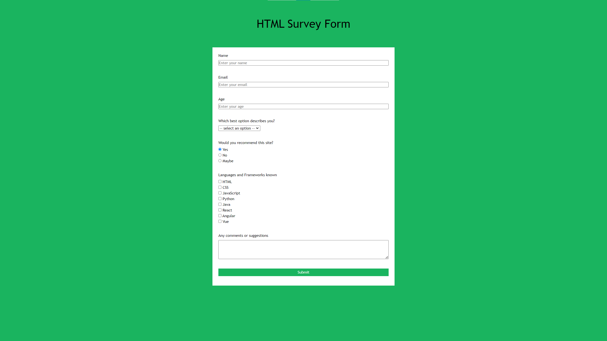
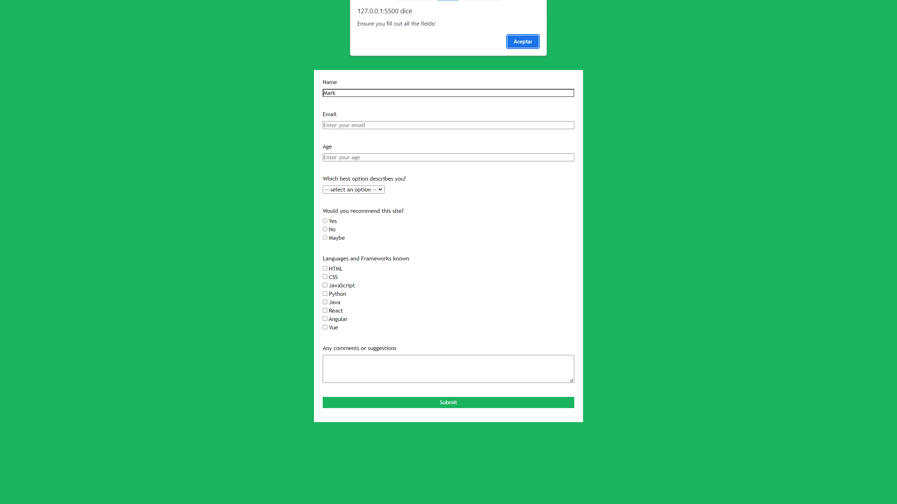
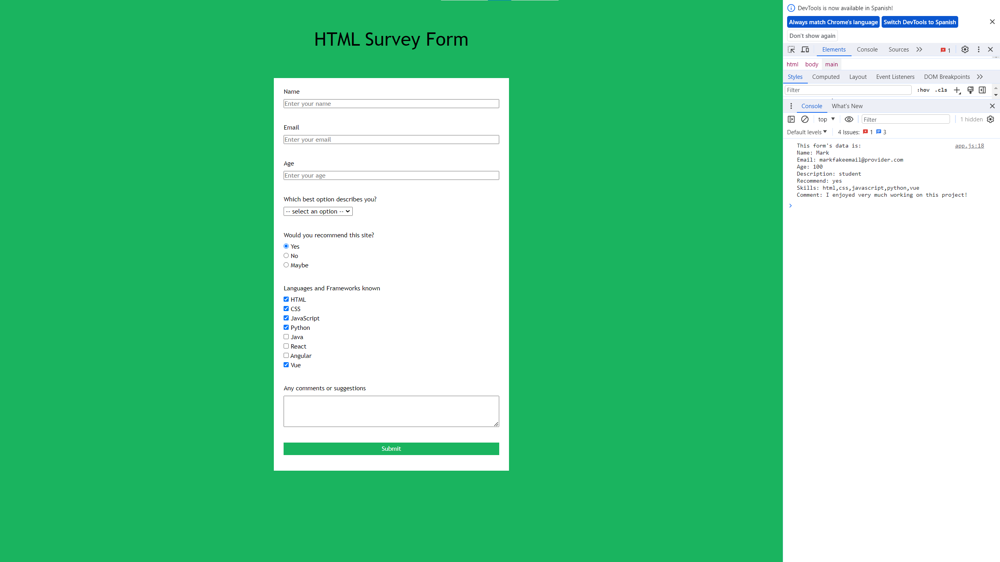

# Survey Form HTML Factoria F5 Study Project

The objective of the project is to build a survey form with different input types. Extra goal is to send the received values to the chrome console using JavaScript.

## Screenshots

Survey Form

Missing field

Form completed

# Thank you for your attention!